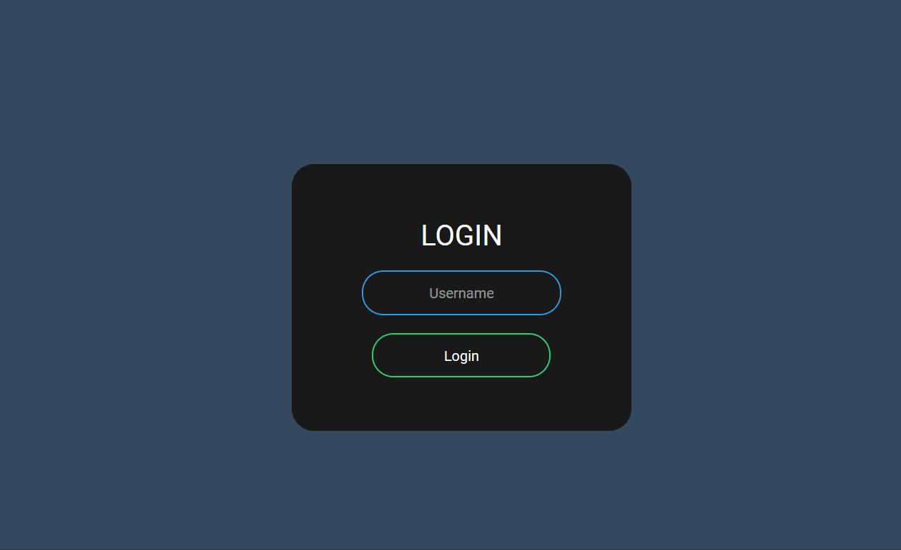
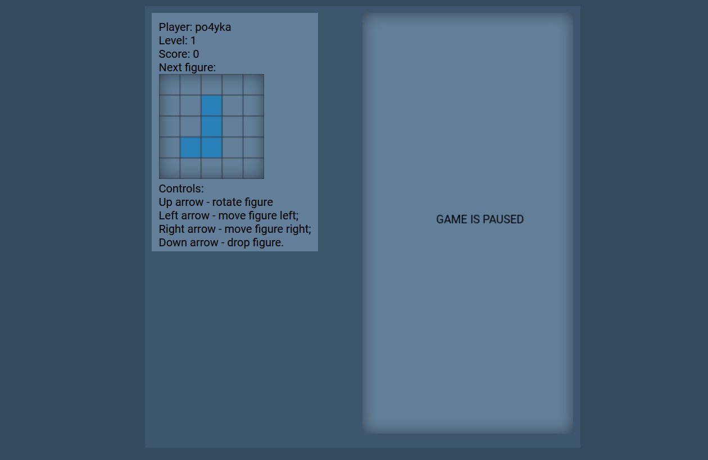
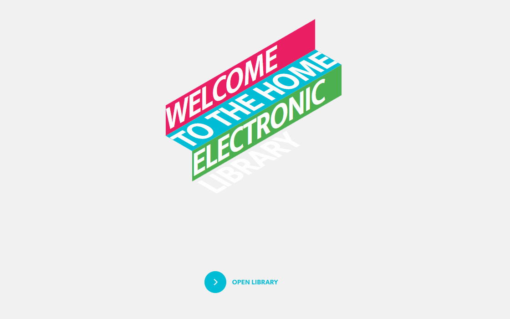
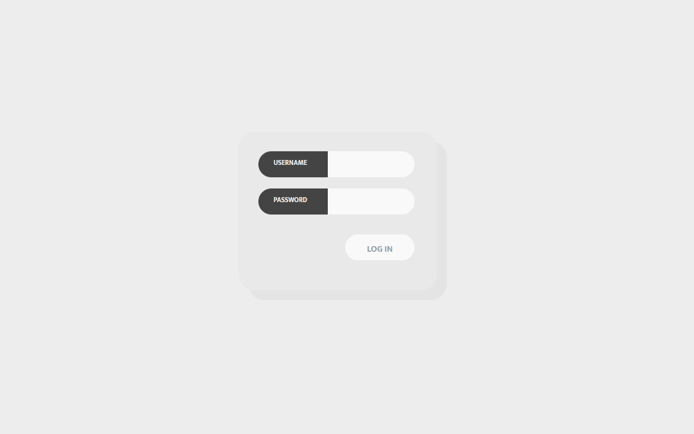
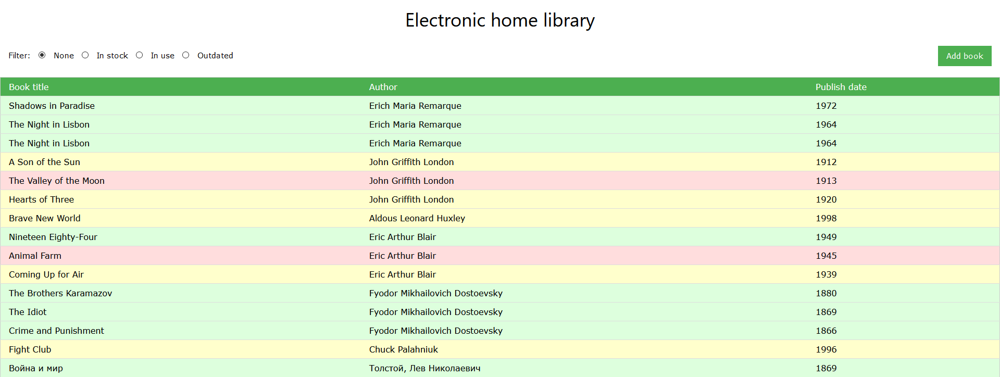

# Wevb course

> Education course of web programming in Saint-Petersburg Electrotechnical University "LETI"

## 1. Tetris game

Technologies used in the project: Node.JS, OpenSSL, JS, HTML, CSS

## 2. Electronic home library

Technologies used in the project: Express, JS, Passport.JS, PUG, CSS

## 3. Art auction

Technologies used in the project: Express, JS, LESS, PUG, JQuery

## Stepik course answers

Web-technology university [course](https://stepik.org/course/4006) answers.